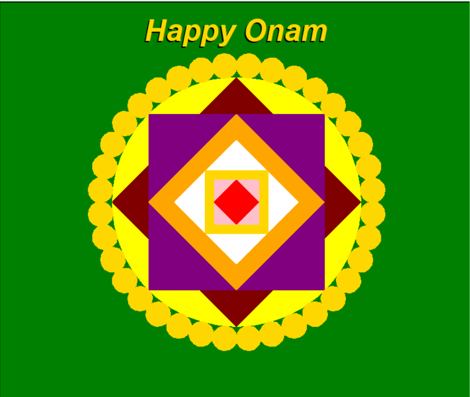

# Code-A-Pookkalam 🌸

A colorful digital Pookkalam made using Python Turtle.  
Created to celebrate Onam with code!

## Requirements
- Python 3.10+
- Turtle graphics (comes pre-installed with Python)

## 📷 Screenshot

## 🎥 [Watch the full simulation](https://youtu.be/45n5grtbppE)

